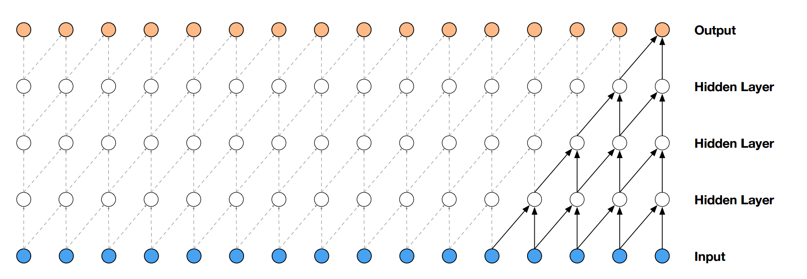
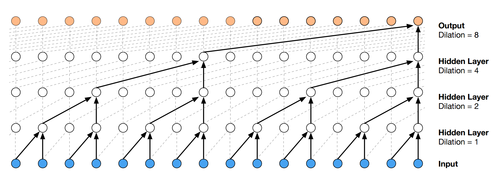
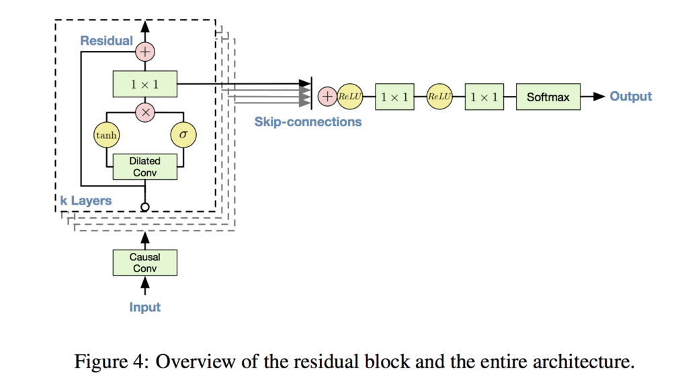

# 4.5 WaveNet

## WaveNetとは

人間の音声に近い音声を生成するモデル

## 音声合成システム

- 波形接続型音声合成システム

    録音された音の断片を連結して合成した音声を出力する手法
	異なる種類の音声に対応するためには都度断片データを作らないといけないので拡張性が低い

- パラメトリック音声合成システム

    録音された音声から特徴を学習したパラメトリックな生成モデルの出力から音声を合成する手法

	- 隠れマルコフモデル音声合成

		パラメトリック音声合成の先駆け
	    音声のスペクトラムを表現する特徴量などの特徴量系列を出力し、ボコーダーによって音声波形に変換される
		モデルが単純なので肉性感は低い

	- ニューラルネットワーク音声合成

		ニューラルネットワークを音声合成モデルに利用する手法
		言語特徴量から音響特徴量への非線形変換をニューラルネットワークでモデル化する
		ニューラルネットワーク音声合成も音響特徴量を出力するが、WaveNetは音声波形を直接出力できる

***

## 学習方法

音声のような時系列があり且つデータ列の長い入力に対して通常の畳み込みを行うと、多数の層を用意する必要があるだけでなく、本来予測したい値（未来の入力）が一緒に畳み込まれてしまう。

これを防ぐために、WaveNetではCausal Convolution、Dilated Causal Convolutionと呼ばれる畳み込み手法を用いて上記の問題に対応している  

- Causal Convolution

	現在とそれ以前の入力を対象とした畳み込み		
	

- Dilated Causal Convolution

	一定の幅を空けたノードを対象とした畳み込みで、層が深くなるにつれて指数関数的に幅が増える  
	

## WaveNetの構造

- ネットワーク
	

	1. Causal Convolution
	1. Residual Block * 複数
	1. 全Residual Blockの結果を合算してReLU関数に渡す
	1. 1 * 1の畳み込み
	1. ReLU関数に渡す
	1. 1 * 1の畳み込み
	1. Softmax関数に渡して出力

- 入力された音声を長さ1152、値範囲256に分割する  
  fragment_length = 1152, nb_output_bins=256

- Residual Blockを繰り返すことで構築されている
	1. Dilated Convolutionの出力をシグモイド関数とtanh関数にかける
	1. それぞれの結果の要素積を計算する
	1. 1 * 1の畳み込み
	1. Dilated Convolutionする前のデータと合算する
