# 4.1 GAN(敵対的生成ネットワーク)とは
### 直観的な理解
    贋作の作成、つまり、より著名な作家の作品をそれらしく見えるように作成するプロセス
---
### 特徴
 - 二つのニューラルネットワークを同時に学習する
    - 贋作の作成者に当たるネットワークである生成モデル(generative model, G(Z))
    - 鑑定士に当たるネットワークである識別モデル(discriminate model, D(Y))
---
### 学習
 - 生成モデル G(Z)
     - ランダムノイズ Zを受け取り、識別モデルが1を出力するように(騙すように)学習する
 - 識別モデル D(Y)
    - 入力 Yを受け取り、本物に近ければ1、偽物に近ければ0を出力する
    - つまり、実際のデータの分布から発生したもに対しては出力を最大に、偽物の分布から発生したデータに対しては出力を最小にするように学習する

> GとDは逆の目的で学習するため、敵対的学習と呼ばれる
---
### GANの全体像
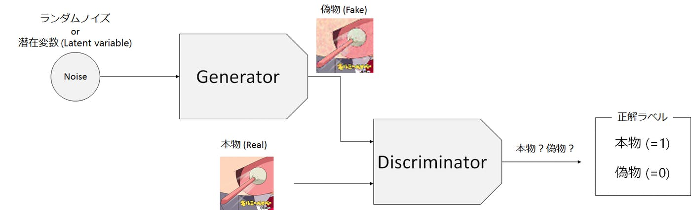
出典：<a href="https://qiita.com/taku-buntu/items/0093a68bfae0b0ff879d">GANについて概念から実装まで　～DCGANによるキルミーベイベー生成～</a>

---
### 重要なポイント
- 識別モデルによる分類が識別モデル自体の学習だけでなく、生成モデルの学習の際にも使用されるため、生成モデルはより多様な状況で識別モデルを騙す方法を学習できる
- 生成モデルがあらゆる場合において、識別モデルを騙せる場合、生成モデルは学習できないくなってしまう。したがって二つのモデルがいい感じに学習する必要がある。（同時に最適解に近づく必要がある）
---
## 4.1.1 GANの適用例
---
### Stack GAN
    テキストの説明からその説明にあった画像を生成する
- Stage-1 : テキスト表現から低解像度の画像を出力
- Stage-2 : Stage-1の出力とテキスト表現から高解像度の画像を出力
---
### サンプル画像
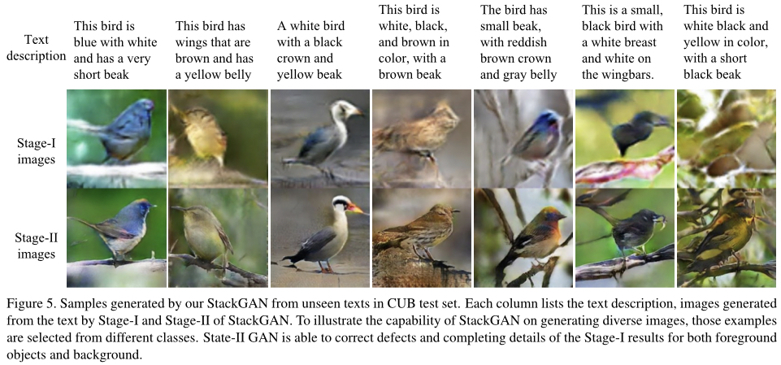

---
### 全体像(参考程度)
- v1  
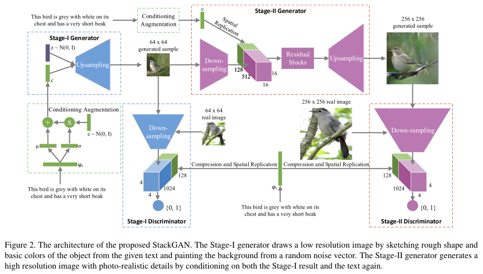  
出典：<a href="https://www.nogawanogawa.com/entry/stackgan">【論文メモ:StackGAN】StackGAN: Text to Photo-realistic Image Synthesis with Stacked Generative Adversarial Networks</a>  
  
- v2  
  
出典：<a href="https://github.com/hanzhanggit/StackGAN-v2">https://github.com/hanzhanggit/StackGAN-v2</a>
---

### 潜在表現(潜在変数)Zを用いた顔の算術演算
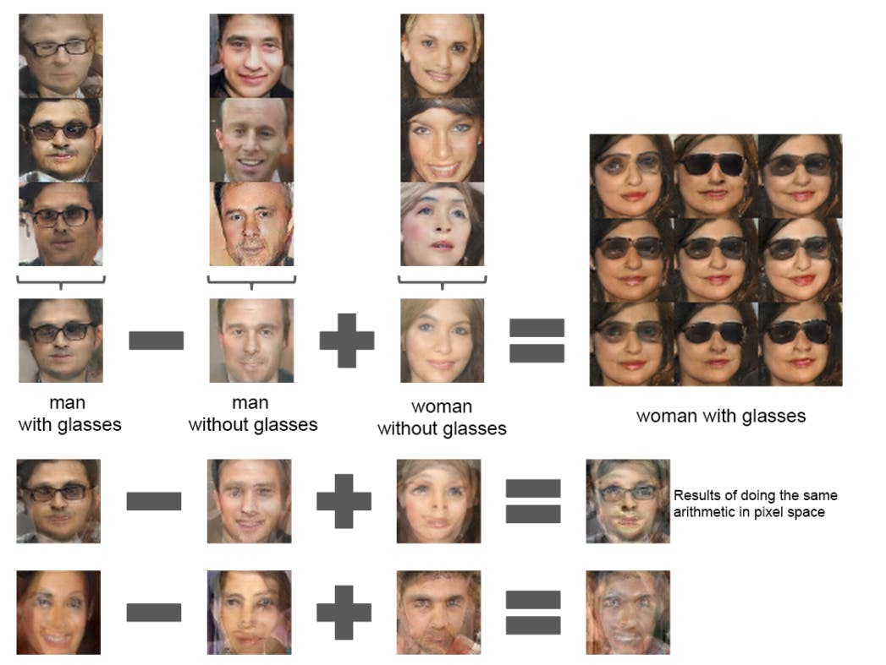  
出典：<a href="https://qiita.com/taku-buntu/items/0093a68bfae0b0ff879d">GANについて概念から実装まで　～DCGANによるキルミーベイベー生成～</a>
　
- Zは様々な属性(性別、眼鏡など)の和だとみなせる
- Generatorに入力する前のノイズから、ある属性ベクトルのみ減算すれば、その属性が取り除かれた画像が生成される。付与する場合は加算する。
  
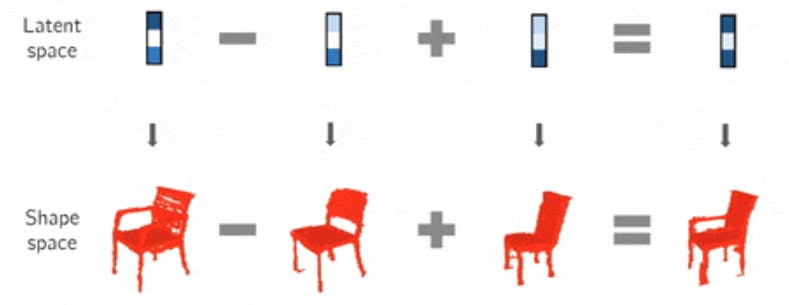  
出典：<a href="https://qiita.com/taku-buntu/items/0093a68bfae0b0ff879d">GANについて概念から実装まで　～DCGANによるキルミーベイベー生成～</a>

# 4.2 深層畳み込みGAN
## 生成モデルの例
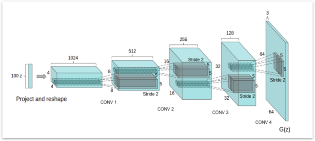  
出典：<a href="https://towardsdatascience.com/developing-a-dcgan-model-in-tensorflow-2-0-396bc1a101b2">Developing a DCGAN Model in Tensorflow 2.0</a>

---

## dcgan.pyの解説

### generator
- Generatorには一様分布や正規分布から取り出してきた潜在変数を入力する(今回は100次元)
- 潜在変数に対して、転置畳み込みを行う(オートエンコーダのデコーダ部分らしい・・・)
    - ノイズの除去や戻画像の復元の際に行う
    - 画像を拡大してから、畳み込みを行う
    - 転置畳み込みのイメージ
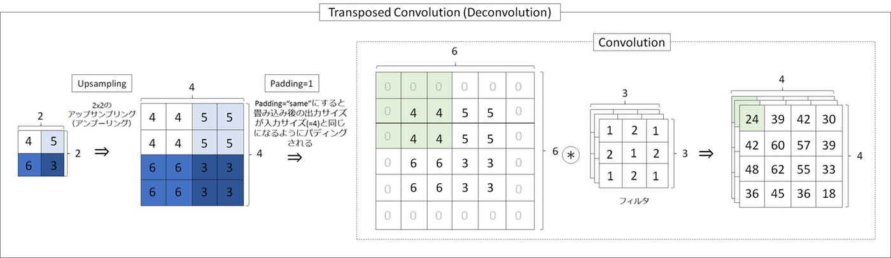  
出典：<a href="https://qiita.com/taku-buntu/items/0093a68bfae0b0ff879d">GANについて概念から実装まで　～DCGANによるキルミーベイベー生成～</a>
    
- コード
```
 1 def generator_model():
 2    model = Sequential()
 3    model.add(Dense(1024, input_shape=(100, ), activation="tanh"))
 4    model.add(Dense(128 * 7 * 7))
 5    model.add(BatchNormalization())
 6    model.add(Activation("tanh"))
 7    model.add(Reshape((7, 7, 128), input_shape=(7 * 7 * 128,)))
 8    model.add(UpSampling2D(size=(2, 2)))
 9    model.add(Conv2D(64, (5, 5),
10                     padding="same",
11                     activation="tanh",
12                     data_format="channels_last"))
13    model.add(UpSampling2D(size=(2, 2)))
14    model.add(Conv2D(1, (5, 5),
15                     padding="same",
16                     activation="tanh",
17                     data_format="channels_last"))
18    return model
```

-  3 行目 : 入力100、出力1024の全結合層。活性化関数はtanh
-  4,5,6 行目 : 出力128 * 7 * 7の全結合層。バッチ正則化。活性化関数はtanh
-  7 行目 : 128 * 7 * 7 のベクトルを幅7 * 高さ7 * 深さ128 という3次元データに変換
-  8 行目 : upsamplingで画像サイズを128 * 14 * 14にする
-  9 行目 : 5 * 5のfilter 64個で畳み込みすることで、64 * 28 * 28の画像を出力
- 13 行目 : upsamplingで画像サイズを64 * 28 * 28にする
- 14 行目 : 5 * 5のfilter 1個で畳み込みすることで、1 * 28 * 28の画像を出力

#### 補足
- tanh:  
    
    - 出力が[-1, 1]となる

- BatchNormalization
    - Batch Normalizationは、Deep Learningにおける各重みパラメータを上手くreparametrizationすることで、ネットワークを最適化するための方法の一つ。
    基本的には、各ユニットの出力をminibatchごとにnormalize(平均1,分散0)した新たな値で置き直すことで、内部の変数の分布(内部共変量シフト)が大きく変わるのを防ぎ、学習が早くなる、過学習が抑えられるなどの効果が得られる。その効果はかなり大きく、Dropoutがいらなくなると言われるレベルとのこと。(本当か?)

### discriminator
- 28 * 28 * 1の画像を入力し、正解かどうか判断する
- 通常のCNN
```
 1 def discriminator_model():
 2    model = Sequential()
 3    model.add(Conv2D(64, (5, 5),
 4                     padding="same",
 5                     input_shape=(28, 28, 1),
 6                     activation="tanh",
 7                     data_format="channels_last"))
 8    model.add(MaxPooling2D(pool_size=(2, 2)))
 9    model.add(Conv2D(128, (5, 5),
10                     activation="tanh",
11                     data_format="channels_last"))
12    model.add(MaxPooling2D(pool_size=(2, 2)))
13    model.add(Flatten())
14    model.add(Dense(1024, activation="tanh"))
15    model.add(Dense(1, activation="sigmoid"))
17
16    return model
```

### generatorの学習
- Generatorの生成画像をDiscriminatorに入力して、本物(=1)と判定されることを目指す
- したがって、GeneratorとDiscriminatorとを組み合わせたCombined_modelを学習させることになる
- 正解ラベルはすべて本物(=1)となる

```
 1 def generator_containing_discriminator(generator, discriminator):
 2    model = Sequential()
 3    model.add(generator)
 4    discriminator.trainable = False
 5    model.add(discriminator)
 6    
 7    return model
```

4行目 : discriminatorは学習させない


## Mode Collapse
Mode Collapseと呼ばれる現象を陥り、GANの学習が失敗。Mode Collapseは、Generatorが一部のデータ分布のみを学習し、そこから抜け出すことができなくなる現象で、Generatorにどのような入力を与えても、ほとんど同じ出力が返ってくる。  
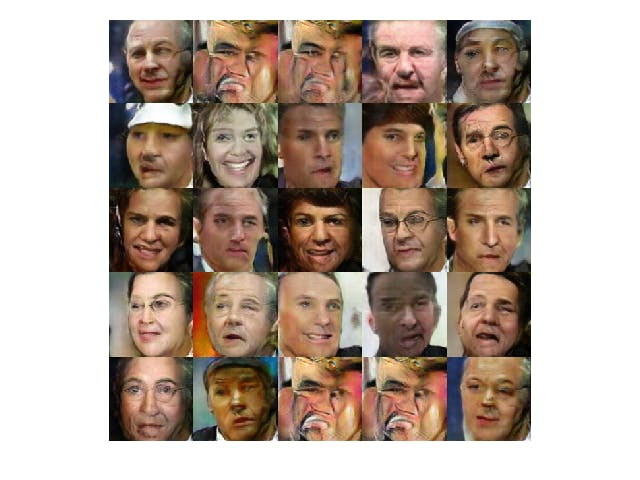  
出典：<a href="https://qiita.com/haru-256/items/b9584d404da3d9ea51e0">Toy ProblemでGANのmode collapseを可視化</a>

### 安定化のために(参考)
- BigGANと呼ばれるGANでは以下の手法を取り入れている  
• Hinge Loss  
• Spectral normalization  
• Self attention  
• TTUR  
• Large batch size  
• Large channel  
• Shared embedding  
• Zero-centered gradient penalty  
• Orthogonal regularization  
• First singular value clamp  
• Truncated Gaussian  

## 生成画像
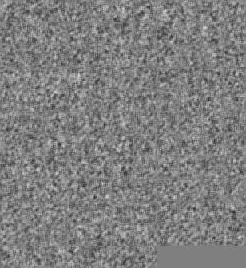  

# 4.3 MNISTを偽造するための敵対的なGAN
 - pythonとパッケージのバージョン指定があるからやるときは一致させる

## 4.2のGANとの違い
- Adversal_Model
    - 複数人のプレイヤーで行うゲームのように学習を進めるらしい
    - 調べる時間なかった・・・
- LeakyReLU
    - x が負でも勾配を持つので、学習が進みやすい
    - 負のときのy=αxのαはあらかじめ学習前に人が設定し不変
    - Reluで発生するdying Relu問題を負でも勾配をもたせることで解消
    

## 生成した画像
- 0 エポック目
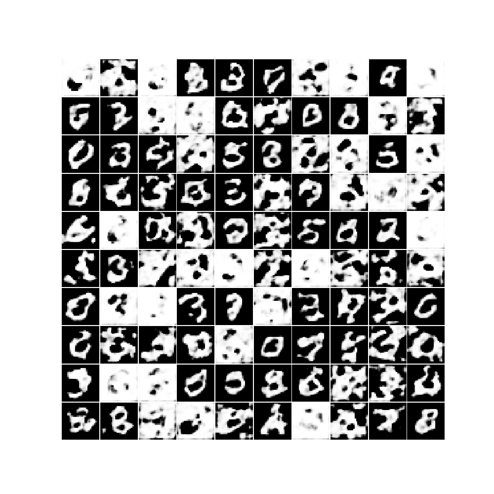
- 10 エポック目
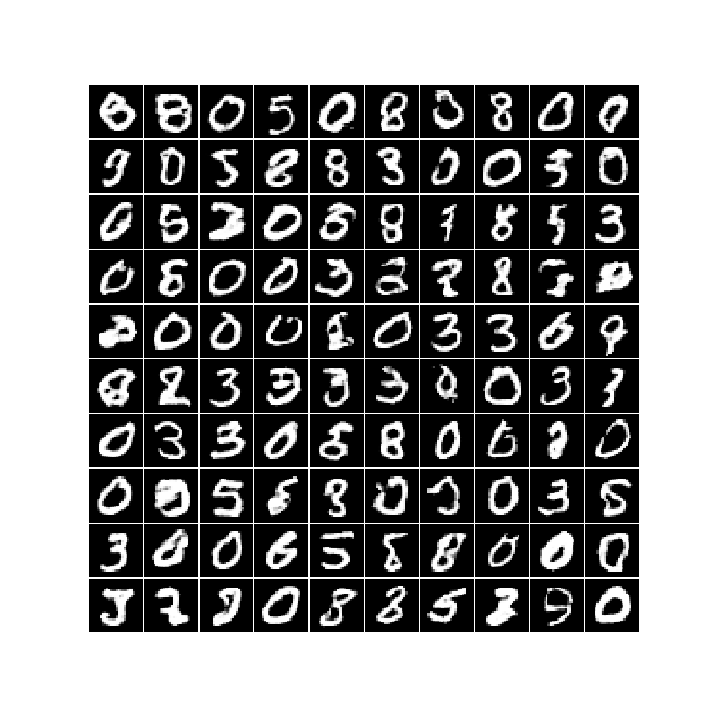
- 50 エポック目
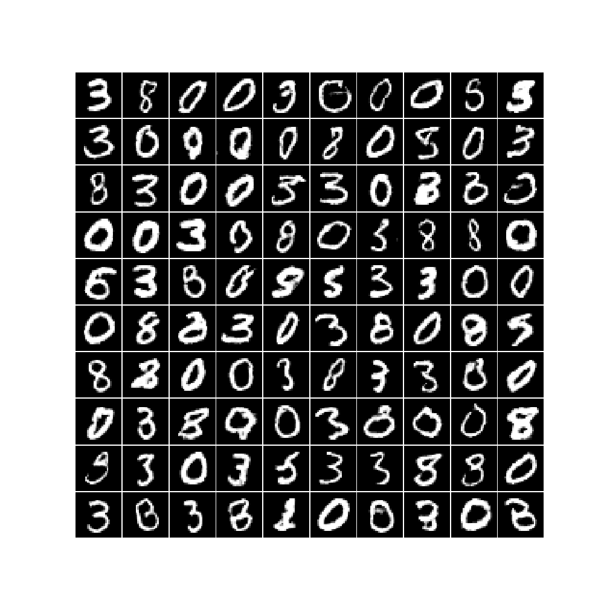
- 99 エポック目
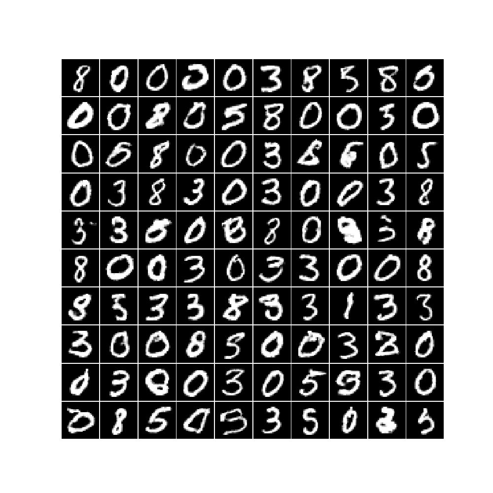


# 4.3 CIFAR-10の画像を生成するGAN
- 基本的には4.2と変わらない
- 層に正則化項が加わっている

# やってみた
- データセット
    - Cartoon Set(https://google.github.io/cartoonset/download.html)
    - データ数 : 100000
    - サイズ : 500 × 500(64 × 64にリサイズして学習)
    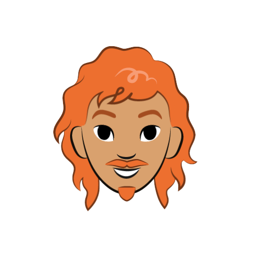
    ## ↓   
     

## 生成した画像
- 0 エポック目
    - 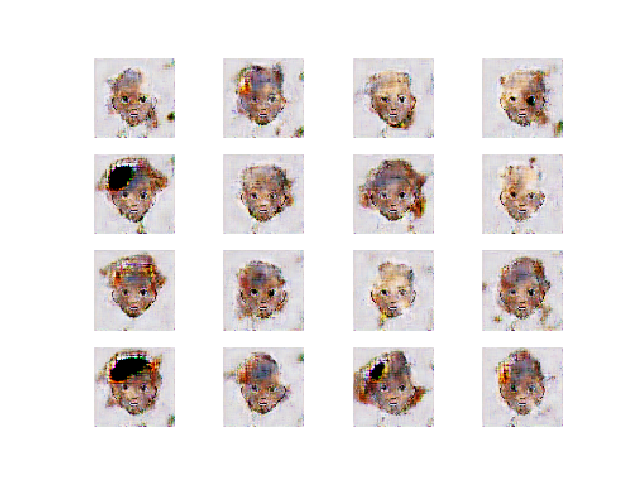
- 10 エポック目
    - 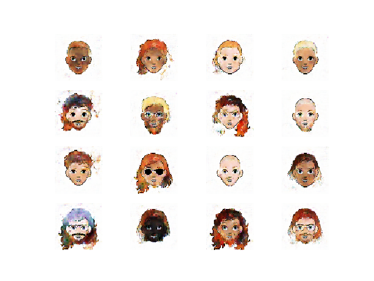
- 50 エポック目
    - 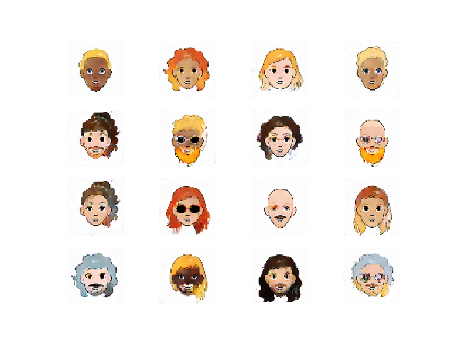
- 一枚 
    - 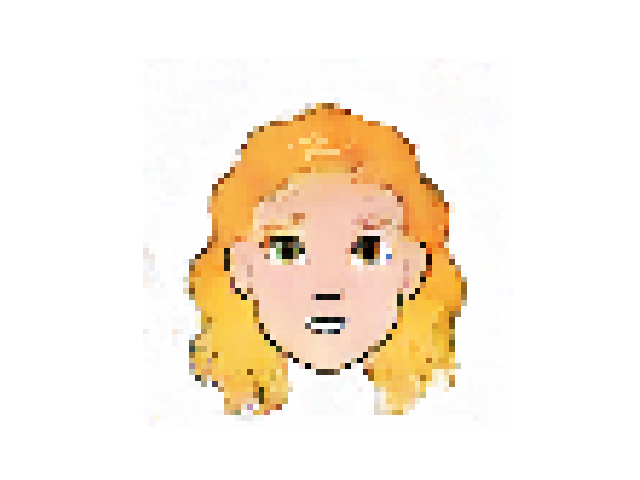

## 属性の演算
### Encoderの作成
- 以下のように本物の画像から、画像の潜在表現Zを生成する様なEncoderを学習する
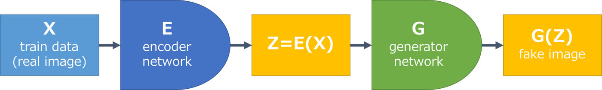

### 属性ベクトルの抽出
- ある属性を持つ画像をEncoderに入力し、その潜在表現を得る
- また、ある属性を持たない画像をEncoderに入力し、その潜在表現を得る
- 得た二つの潜在表現を減算することで、属性ベクトルを得ることができる
    - 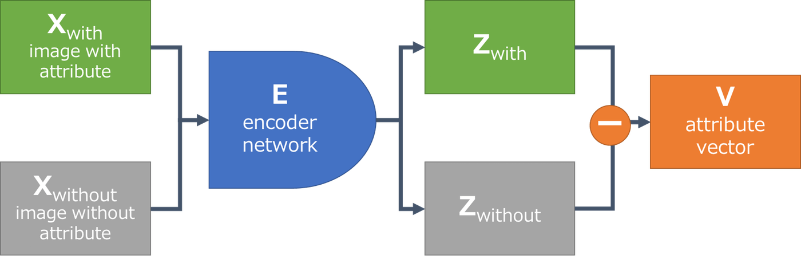

### 眼鏡属性の付与
- 元画像 
    - 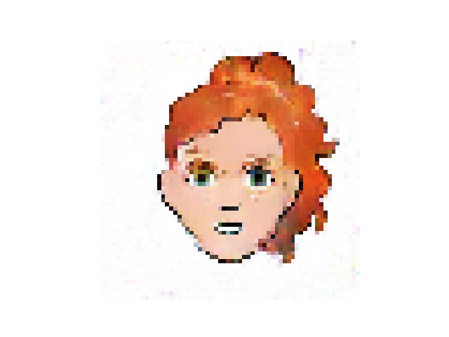

- 眼鏡を付与 
    - 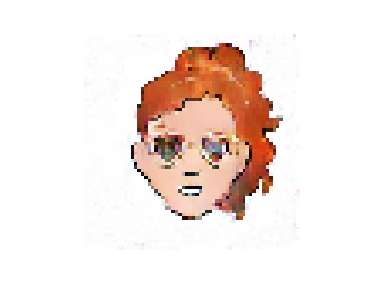


