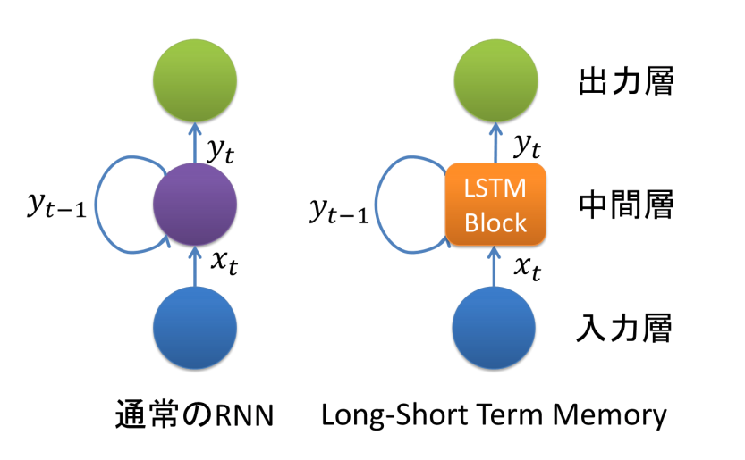
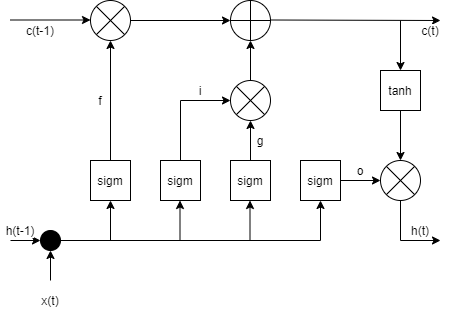
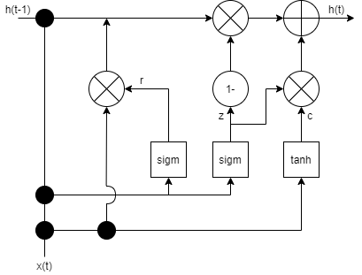

# 6章 リカレントニューラルネットワーク

## 6.4 LSTM(long short-term memory : 長短期記憶)
- 長期依存性を学習できるRNNの亜種
- SimpleRNNでは前の時刻の隠れ状態とtanh層の現在の入力を使用していたが、LSTMは単一のtanh層の代わりに4つのレイヤー非常に特殊な方法で相互作用する

### ■ SimpleRNNとLSTMの違い

参考URL： https://qiita.com/t_Signull/items/21b82be280b46f467d1b

### ■ LSTM Block

 ・・・ 入力ゲート  
 ・・・忘却ゲート  
 ・・・出力ゲート  
 ・・・ 内部隠れ状態   
 ・・・ 時刻tにおけるセル状態  
 ・・・ 時刻tにおける隠れ状態

- 入力ゲート(i)
    - 現在の入力xtに対して、新しく計算された状態をどのくらい通過させるかを定義する。
- 忘却ゲート(f)
    - 前の状態ht-1をどの程度通過させたいか定義する。
- 出力ゲート(o)
    - 内部状態をどの程度次の層に晒したいか定義する。
- 内部隠れ状態(g)
    - 現在の入力xtと前の隠れ状態ht-1に基づいて計算される
- 時刻tにおけるセル状態(ct)
    - 以前のメモリと新しい入力設定を結合する。oが0の場合古いメモリは無視され、iが0の場合新しく計算された値が無視される
- 隠れ状態(ht)
    - メモリctに出力ゲートをかけることによって求まる

## 6.4.1 LSTMで評判分析
- 多対一のRNNを構築して学習させる。

## 6.5 GRU(gated recurrent unit : ゲート回帰付きユニット)
- LSTMの亜種
- LSTMと同様、勾配消失問題に対する耐性がある
- LSTMよりも内部構造が簡単で、計算量が少ない
- GRUは学習が速く、汎かに必要なデータ量がそれほど必要ではない。LSTMは十分なデータ量がある場合にGRUよりもよい結果になることがある

・・・更新ゲート  
・・・リセットゲート  
・・・セル状態  
・・・隠れ状態

- 更新ゲート
    - どの程度以前のメモリを保持するかを定義
- リセットゲート
    - 新しい入力と、前のメモリとの結合方法を手定義
