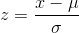

# 7章 さまざまなディープラーニングのモデル

## 7章の概要

これまでは付与されたラベルを識別するために有用な入力データの特徴を学習し、
未知のデータに対してもラベルが予測できるようにモデルを訓練してきた。  
作成したモデルはKerasの`Sequential model API`を使用して、
入力から出力までが一本のパイプラインになるように実装していた。

7章では以下のトピックについて取り上げる。
- `functional API`の使い方
- 回帰問題を扱うネットワークを構築する方法
- 自己符号化器（autoencoder）で教師なし学習を行う方法
- `functional API`を組み合わせてネットワークを構築する方法
- `backend API`を利用したカスタムコンポーネントの作成方法
- 画像に対する生成モデルの適用

## 7.1 functional API

ネットワークを構成する各層を関数と定義し、組み合わせることでネットワークを構築する。

`Sequential model API` を使ったモデル定義
```python
from keras.models import Sequential
from keras.layers import Dense, Activation

# Sequential model API を使った単一パイプラインのモデル
model = Sequential([
    Dense(32, input_shape=(784,)),
    Activation('relu'),
    Dense(10),
    Activation('softmax'),
])
```

このモデルを数式で表すと、以下のようになる


入れ子になった関数はそれぞれ以下


functional APIを使用して表現すると以下のようになる
```python
from keras.layers import Input, Dense, Activation
from keras.models import Model

# (None, 784) の行列を入力として定義
x = Input(shape=(784,))
# 32次元の全結合層
g = Dense(32)
# relu層
s_2 = Activation('relu')
# 10次元の全結合層
f = Dense(10)
# softmax層
s_K = Activation('softmax')

# 関数が入れ子にしてSequenceを作成
y = s_K(f(s_2(g(x))))

# モデルを構築
model = Model(inputs=x, outputs=y)
model.compile(loss="categorical_crossentropy", optimizer="adam")
```

---

学習済みのモデルも関数として使うこともできる  

ex) 学習済みの画像分類モデルを時系列の入力を扱う`TimeDistributed`に組み込む  
`processed_sequences = TimeDistributed(trained_model)(input_sequences)`

また、Sequential APIとfunctional APIを併用することで以下のネットワークを定義することもできる

- 複数の入出力を持つモデル
- 複数のサブモデルを組み合わせて作成するモデル
- 層を共有するネットワーク

複数の入出力を持つモデルは以下のような定義になる  
`model = Model(inputs=[input1, input2], outputs=[output1, output2])`

---

## 7.2 回帰を行うネットワークの構築

教師あり学習における主要なタスクは`分類`と`回帰`で、どちらもモデルはデータに付与されたラベルを予測するように訓練される

- 分類：ラベルは文書のジャンルや画像のカテゴリといった離散値
- 回帰：ラベルは株価や気温といった連続値

本節は回帰を解くためのアプローチを行っていく

### 7.2.1 回帰モデルの実装：大気中のベンゼンの濃度の予測

- make_model(input_size)
  - 層の初期化に`glorot uniform`という手法を用いている

- main()
  - 予測に使う各特徴で分布範囲に差がある場合は正規化を行うことが推奨されている
  - 数値データに対する正規化は、各列において平均を引き、標準偏差で割る

      

---

## 7.3 教師なし学習：自己符号化器

### 自己符号化器とは
  - 入力を復元するようなネットワークで、通常のニューラルネットワークと同様に誤差逆伝播法で学習される  
  - 入力を読みだしてコンパクトな表現に圧縮する`エンコーダー`と、コンパクトな表現から元の入力を再構成する`デコーダー`の２つの部分で構成される
  - 再構成における誤差を最小化することを目的に学習する
  - エンコーダーを通すことで、元のデータの特徴を残しつつ小さいサイズでデータを扱うことができる
    - 主成分分析と似た効果が得られる
  - エンコーダーだけ使って、圧縮した表現を分類に使うこともできる

### エンコーダー、デコーダーの実装
- さまざまな方式で実装が可能
  - 全結合層
    - 協調フィルタリングで用いられる
    - 圧縮したユーザーの評価データから嗜好を表す表現を獲得する
  - CNN
    - 画像の表現圧縮
  - RNN
    - テキストや時系列データの圧縮

- エンコーダーを積み重ねてより小さいサイズに圧縮することが可能
  - デコーダーは逆の順で積み重ねて復号する

### 7.3.1 自己符号化器の実装：文ベクトルの作成

文中に登場する単語ベクトルを合算して単語数で割る手法は単語が登場する順番は考慮されない  
LSTMで語順を考慮した文ベクトルの作成をする

実装の構成は以下
- ReutersCorpus（データの読み込みを行う）
- EmbeddingLoader（事前学習済みの単語ベクトル GloVeを読み込む）
- Autoencoder（モデルの定義）
- main（モデルの学習を実行する）
- predict（学習したモデルを利用して、文の分類を行う）

ReutersCorpus
  - batch_iter()
    - 単語の特徴を表す事前学習済みのベクトルに変換するメリットは以下
      1. 単語のインデックスを使用する場合に比べて、ベクトルのサイズを小さくできる
      2. 「事前学習」の結果を使用できる
