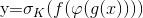

# 7章 さまざまなディープラーニングのモデル

## 7章の概要

これまでは付与されたラベルを識別するために有用な入力データの特徴を学習し、
未知のデータに対してもラベルが予測できるようにモデルを訓練してきた。  
作成したモデルはKerasの`Sequential model API`を使用して、
入力から出力までが一本のパイプラインになるように実装していた。

7章では以下のトピックについて取り上げる。
- `functional API`の使い方
- 回帰問題を扱うネットワークを構築する方法
- 自己符号化器（autoencoder）で教師なし学習を行う方法
- `functional API`を組み合わせてネットワークを構築する方法
- `backend API`を利用したカスタムコンポーネントの作成方法
- 画像に対する生成モデルの適用

## 7.1 functional API

ネットワークを構成する各層を関数と定義し、組み合わせることでネットワークを構築する。

`Sequential model API` を使ったモデル定義
```python
from keras.models import Sequential
from keras.layers import Dense, Activation

# Sequential model API を使った単一パイプラインのモデル
model = Sequential([
    Dense(32, input_shape=(784,)),
    Activation('relu'),
    Dense(10),
    Activation('softmax'),
])
```

このモデルを数式で表すと、以下のようになる



入れ子になった関数はそれぞれ以下


functional APIを使用して表現すると以下のようになる
```python
from keras.layers import Input, Dense, Activation
from keras.models import Model

# (None, 784) の行列を入力として定義
x = Input(shape=(784,))
# 32次元の全結合層
g = Dense(32)
# relu層
s_2 = Activation('relu')
# 10次元の全結合層
f = Dense(10)
# softmax層
s_K = Activation('softmax')

# 関数が入れ子にしてSequenceを作成
y = s_K(f(s_2(g(x))))

# モデルを構築
model = Model(inputs=x, outputs=y)
model.compile(loss="categorical_crossentropy", optimizer="adam")
```

---

学習済みのモデルも関数として使うこともできる  

ex) 学習済みの画像分類モデルを時系列の入力を扱う`TimeDistributed`に組み込む  
`processed_sequences = TimeDistributed(trained_model)(input_sequences)`

また、Sequential APIとfunctional APIを併用することで以下のネットワークを定義することもできる

- 複数の入出力を持つモデル
- 複数のサブモデルを組み合わせて作成するモデル
- 層を共有するネットワーク

複数の入出力を持つモデルは以下のような定義になる  
`model = Model(inputs=[input1, input2], outputs=[output1, output2])`
