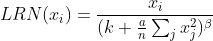
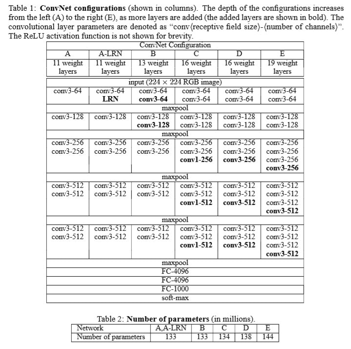
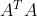
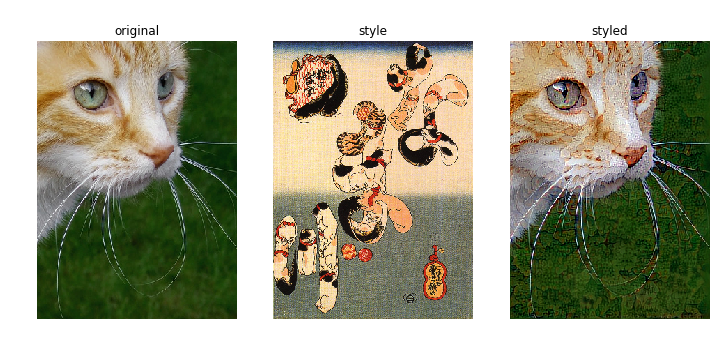
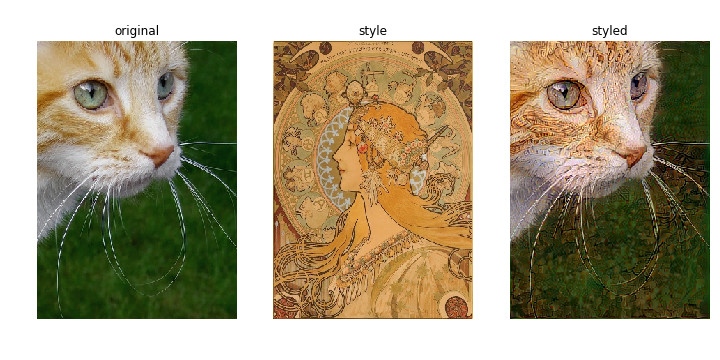

# 7.4 ネットワークを組み合わせる：複合ネットワーク

- これまで紹介された全結合、CNN、RNNのネットワークを組み合わせることでより複雑なモデルを作成することができる
- 複合ネットワークは特定のタスクに対して特別に作られる場合が多い
- 多くの場合は複数の入力をとるか、複数の出力を行う
    - 複数の入力をとる例
        - 質問回答のネットワーク
        - 画像の類似性を計算するsiamese(サイアミーズ)ネットワーク
    - 複数の出力をとる例
        - 画像のオブジェクトの位置とそのカテゴリを同時に予測するネットワーク
  
## 7.4.1 複合ネットワークの実装：質問回答を行うMemory Netowork

- 質問回答を行うMemory Networkを構築する
- 本体のNetWork（通常はRNN）と記憶を格納するためのメモリユニットを組み合わせた構造
- Facebookの[bAbI](https://research.fb.com/projects/babi/)の質問タスクを実施

# 7.5 Kerasのカスタマイズ
- Kerasでは多くの機能が組み込まれているがカスタマイズのための機能も組み込まれている
- TensorFlowやCNTKといったバックエンドを呼び出すがこの複数のバックエンドにまたがる処理を実装するために[Keras backend API](https://keras.io/backend/)を提供している
    - CNTK:Microsoft Cognitive Toolkit　マイクロソフトリサーチによって開発されたディープラーニングフレームワーク
- 実装した処理を実行する際にはユーザが選択したバックエンドに応じて適切な呼び出しが行われる

## 7.5.1 層のカスタマイズ：Lambda層の使用
- Kerasには独自の関数処理を組み込めるLambda層を提供している
- 例えば要素単位で値を二乗する層を作成する際は以下のように記述する  
  model.add(Lmabda(lambda x: x ** 2))
- 外部で定義した関数をLambda層で使用することも可能

## 7.5.2 層のカスタマイズ：カスタムの正規化層を作成する
- Lambda層は便利だが場合によっては層内で多くの処理を実装する場合がある
- 例として局所応答正規化(local response normalization)と呼ばれる処理をカスタムレイヤーで実装する
    - 局所応答正規化は各入力をその周辺の値で正規化する手法
    - 現在ではより有効なドロップアウトやバッチ正規化、より良い初期化方法が発見されたためあまり用いられない
- Kerasにおける層の扱い
    - 計算グラフの構築プロセス
    - 実際のデータが計算グラフ上を流れるプロセス
- カスタムレイヤーの実装を進める方法として簡単なテストで確認しながら進めることが推奨される
- 局所応答正規化はCaffeというフレームワークで利用されたのが始まり
    - 詳細はCaffeの[ドキュメント](http://caffe.berkeleyvision.org/tutorial/layers/lrn.html)を参照
- 脳の側方抑制という機能を模倣したもので入力を周辺の値で正規化する
- 各範囲の値は以下の式によって正規化される  

- カスタムレイヤーは特定の目的を達成するために作られるもので汎用的に作られることはあまりない
- カスタムレイヤーでできることは以下のブログ記事を参照することでヒントを得られる
    - Keunwoo Choi: [For beginners; Writing a custom Keras layer](https://keunwoochoi.wordpress.com/2016/11/18/for-beginners-writing-a-custom-keras-layer/)
    - Shashank Gupta; [Writing a custom model in Keras with a demonstration on Graph EMbedding problem](http://shashank-gupta.com/2016/10/12/Custom-Layer-In-Keras-Graph-Embedding-Case-Study/)

# 7.6 生成モデル
- 生成モデルは学習データに近いデータを生成するように学習させたモデル
- 第6章で紹介されたRNNや第4章で紹介されたGANが当てはまる
- 生成モデルは入力データそのものの構造をラベルがない状態から推定することが可能
- 現実世界ではラベルがついていないデータが多いため上記の性質は大きな利点となる

## 7.6.1 生成モデルの実装:Deep Dream
- 事前学習済みのCNNを利用して画像の中にオブジェクトを生成するもの
- 十分に学習された識別モデルが獲得しているはずの「入力の特徴をよく表す潜在表現」を生成に利用しようとする試み
- Deep Dreamは勾配の計算を入力された画像に適用する
- これによりそのままでは可視化しにくい高次元の隠れそうが何を捉えようとしているか間接的に見ることができる
- 事前学習済みのモデルVGG-16を使用し、選択したプーリング層の出力の平均を最大化するように入力画像を変更する

## 7.6.2 DeepDreamの応用：スタイルトランスファー
- Deep Dreamを応用した技術としてスタイルトランスファーという技術が提案されている
    - VGG-16のような事前学習済みモデルはコンテンツとそのスタイルの2つを学習していて、それらを独立して操作できる
    - 同じ風景を別々の画家が描くと結果が異なるように同じコンテンツに様々なスタイルを適用できる
- 学習済みモデルとしてVGG-19を利用する  

- スタイルトランスファーを行うために重要な3つの誤差を以下のように定義する
    - Content loss  
      元の画像を維持するための誤差。作成した画像と元の画像の間の二乗誤差で計測する
    - Style loss  
      スタイルを適用するための誤差。学習済みモデルの佐生は画像の特徴を捉える力を持つため各層における2つの画像(コンテンツとスタイル画像)の出力を近づければスタイルが近くなる。内積空間(gram_matrix)で比較を行う。gram_matrixは行列Aに対して次で計算される。  
      Style lossではgram_matrixの差分で比較を行う
    - Total variation loss  
      近くのピクセルの値はなるべく近しくなるようにするための誤差。画像を滑らかにする効果がある。
- 適用結果  

- ミュシャ　　
