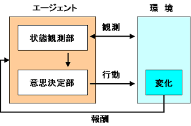

> # 8章 AIによるゲームプレイ
- 本章では強化学習と、ディープラーニングを強化学習に適用する方法について学ぶ
- 強化学習とは
    - 教育対象となるエージェントには、正しい行動に対して報酬が与えられ、間違った行動に対してはペナルティ(負の報酬)が与えられる。これを繰り返し、ある状態における最適な行動を学習する、機械学習の手法の一つ。
    - ディープラーニングを利用して作成された強化学習も同様で、ある入力に対してネットワークが望ましい出力（行動）を行うか否かによって報酬が与えられ、学習が行われる。
- ディープラーニングを強化学習を適用する手法は2013年にDeep Mindというイギリスの会社で発表された。
- 本章では、このディープラーニングの強化学習への適用についてその理論的な仕組みを見ていく。またこの仕組みをKerasで実装し、ボールキャッチゲームをプレイ学習させる。

■ 以下の3つのコンセプトを学ぶ
- Q-learning
- exploration vs exploitation(探索と活用のバランス)
- Experience Replay(経験と蓄積と活用)

> ## 8.1 強化学習(Reinforcement Learning, RL)
- 本章のゴールは、ボールキャッチゲームをプレイできるニューラルネットワークを構築すること

#### 実装の方針
- ネットワークをより多くのゲームに対応させるたいので、座標ではなくゲーム画面をそのまま状態として認識させる
- ボールキャッチゲーム(図8-1)の場合、出力が3つのアクション(左へ移動、とどまる、右へ移動)からの選択となる分類問題としてもモデル化ができるが、その場合この場合学習するために上手な人間のプレイを録画し、プレイ中の各画像を学習データとして用意する必要がある。
- 代わりのアプローチとして、ネットワークを構築してゲームを繰り返しプレイさせ、ボールのキャッチに成功したかどうかに基づいてフィードバックを与える。
    - これはより直観的で、人間や動物が学ぶ方法に近い。このアプローチを行う一般的な方法は、「**マルコフ決定過程(Markov decision process: MDP**」と呼ばれる

---
### ■ マルコフ決定過程
マルコフ決定過程は、状態遷移が確率的に生じる動的システム（確率システム）の確率モデルであり、状態遷移がマルコフ性を満たすものをいう

以下の4つの要素からなる
-   →  st : 時刻tにおける環境の状態, S : 状態の有限集合
-   →  at : 時刻tにおけるエージェントの行動, A : エージェントの行動の有限集合
-  → 遷移関数 : 状態stにあり、行動atをとったとき、状態st+1になる確率
-  → 報酬関数 : 状態stから状態st+1に行動atを伴い遷移する際に得られる即時報酬またはその期待値

エージェントは特定の行動atを実行し、行動atによって環境stは次の環境st+1へ遷移する。またこの行動によって報酬rtを得ることがある。この状態、行動、報酬のセットは、ある状態から別の状態へ移行するための「ルール」とともにマルコフ決定過程を構成する。また、この一連の流れ（一ゲーム）をエピソードと呼ぶ。

■ 用語
|  用語  |  説明  |
| ---- | ---- |
| マルコフ性 | 状態st+1への遷移がその時の状態stと行動atにのみに依存し、それ以前の状態や行動に関係ないこと |
| エルゴート性 | 任意の状態stからスタートし、無限時間経過した後の状態分布は最初の状態をは無関係なること |

> ### 8.1.1 将来の報酬を最大化する
#### 報酬の最大化
- 学習の目的は、エージェントが各エピソードで獲得する報酬の総和を最大にすること(報酬を最大にするような最適なルールを求めること)
- 報酬は以下のように表せる
    - 
- 時刻tからの報酬の総和は以下のように表せる
    - 
- この時、エージェントは目先のrtではなく、時刻tからの報酬の総和であるRtを最大化する必要がある

#### 割引率
- 将来の報酬と、現在の報酬では現在の報酬に重きを置くのが現実的であるため、将来の報酬には割引率を適用する。これは先の報酬になるほど割引率γをかけて報酬を割り引くという手法であり、現在割引価値とよばれる
- 割引率を適用した場合の報酬は以下のようになる
    - 

- γが0の場合、将来の報酬を考慮しない（報酬が得られない）、γが1の場合、将来の報酬が確約されていることを表す。おおむねγは0.9とすることが多い

----
例えば、以下のようなことが考えらる。

- 状況からトラップが仕掛けられていそうかどうかを予測して、宝箱を取るべきか取らないべきかを判断する。
- 仮にトラップなどがあったとしても、状況から予測して少ない損害で獲得できそうか判断する。

このように、普通は行動の際には将来に対する予測（推論）を挟んで、リスクとリターンを省みて、どうすれば一番利益を最大化できるかを考えるはずという考え方。　→　***ベルマン方程式***

---

- エージェントはこの割引現在価格の総和Rtを最大化するように学習を行う必要がある
- 報酬を最大化するためには、その報酬を得るためにする行動を決める最適な行動を決定する必要がある。
    - 最適化の方法の一つにQ-learningがある

> ### 8.1.2 Q-learning
#### Q-learning
- DeepMindが発表した深層強化学習モデル
- 有限マルコフ決定過程において、ある状態において最適な行動を見つけるために使用できる手法

#### 関数定義
- 状態sにおいて行動aを実行するときの割引現在価値をQ関数の出力(Q値)という形で定義する  
  - 

- 任意の状態において最適な行動を選択する戦略πは以下になる  
  - 

- 現在のQ関数を次の状態のQ関数を用いて以下のように定義する（ベルマン方程式 or 行動価値関数）。
- 「直近で得られる報酬」に「将来得られる報酬の推論値（割引率を加味）」を加えた値が最大になるように行動するという意味。
  - 

##### 参考
- 状態価値関数 V(s)     : 状態sの価値（方策に従う）
- 行動価値関数 Q(s, a)  : 状態sの時に行動aを選択した時の価値（行動aのあとは方策に従う）

https://www.renom.jp/ja/notebooks/tutorial/reinforcement_learning/DQN-theory/notebook.html

#### Q-table
- Q関数は状態sの時に行動aをとるとどれくらいの価値(Q(s,a))が見込めるかを出力するものであり、これはクロス表のようなものととらえることができる。

- このQ-tableの中身を精緻化していけば、それはQ関数の出力を精緻化することに等価になる

#### アルゴリズム
- Q-tableの中身を精緻化する過程は以下のようになる

1. Q-tableをランダムな値で初期化する
2. 適用な行動aを実行し、報酬が発生すればそれを得る
3. 得られた報酬を利用し、ベルマン方程式から状態sにて行動aをとった場合の割引現在価値(Q(s,a))を計算し、その値で表を更新する
4. 遷移した状態s'にて、適当な行動a'を実行する（＝2に戻る）

        initialize Q-tables Q
        observe initial state s
        repeat
            select and execute action a
            observe reward r and move to new state s'
            Q(s, a) = Q(s, a) + α(r + γ max_a'Q(s', a') - Q(s, a))
            s = s'
        until episode end

r + γ max_a'Q(s', a')　　　　　:　実際に行動した時の価値  
r + γ max_a'Q(s', a') - Q(s, a) 　:　予測値と実測値の差  
この更新を繰り返すことで、Q(s, a)を平均化していく

#### 参考
確率的勾配降下法の更新式
        
        w = w - η∇Qi(w) 

> ### 8.1.3 ディープニューラルネットワークによるQ関数の実装
Q関数(Q(s,a))をニューラルネットを用いて、関数近似する

#### 条件設定
- 80×80のゲーム画面
- 4フレームを合わせたものを一つの状態とする（ボールの動きが分かるように）
    - 2の80×80×4乗のパターンが必要であり、Q-tableも同じサイズ用意する必要があるが、CNNを使用すれば組み合わせ爆発を防ぐことができる
- 状態(連続した4画面)をインプットし、行動価値(左、右、停止のQ値)を出力する
    Q-tableの行を出力することに対応する
- 誤差関数
    - 

> ### 8.1.4 探索(exploration)と活用(exploitation)のバランス
 - 強化学習はデータが入り次第学習を行うオンライン学習の側面がある（バッチ学習は対極に位置する）
 - 学習の手記はなるべく新規データを得ること、いうならばランダム行動を行うことがパフォーマンスの向上につながる。
 - そのまま学習してしまうと、価値の高いほうにしか行動しようとしなくなる。これを解決するための方法に「ε-greedy法」がある。

 #### ε-greedy法
 - εの確率でランダムに行動し、1-εの確率でネットワークの学習結果を活用して行動する方法
 - 学習が進むにつれQ関数の信頼度が上がってくるため、ランダムに行動する確率εを下げていく

 多く探索したほうが正確なQ関数が得られるが、その分学習成果を活かす時間が短くなる。その逆も然りでこれらは***探索と活用のトレードオフ***という。ε-greedy法を用いることで少ないパラメータでこのトレードオフを調整することができる

> ### 8.1.5 Experience Replay(経験の蓄積と活用)
時系列で並んでいるinputデータを順々に使って学習を進めると、inputデータ間の時系列の特徴に影響を受けてしまうため、一旦、観測した(s,a,s′,R(s,a))(s,a,s′,R(s,a))をメモリDに保存しておいて、ランダムにデータを取り出して学習させるというもの。（連続するフレームのほとんどは似たような画面であり、次の画面の出力も似たような画面になってしまう。

- 行動結果を保存しておくメモリを***replay memory***という
- メモリから呼び出して学習に利用する手法を***Experience Replay***という
- 最初はメモリはmemoryは空のため、人間のプレイをから収集たり、ランダムに埋めたりする

> ### 8.1.6 Q-networkの固定
Q関数の更新には、Q(s',a')という、次の状態における報酬の期待値が必要であり、これはQ関数自体を利用計算される。このため更新を行った俊会にQ(s',a')の値も変わる。これは正解データが変わってしまうことになるため、好ましくない。  
これを対処するため、Q(s',a')の算出には一定期間、重みを固定したネットワークを使用する。これにより学習を安定させることができる。ある程度学習が進んだら教師側の重みを更新し、これを繰り返す。

> ### 8.1.7 報酬のクリッピング
ゲームによって設定されている報酬は様々で、同じ1点でもゲームによって価値が異なる。  
これらは学習に有利に聞く場合があるが、設定が難しくなる。  
そのため、報酬については失敗-1、成功1、というように固定してしまう。

#### 3つの工夫
1.  Experience Replay
2. Q-networkの固定
3. 報酬のクリッピング

上記の3つの工夫を加えたディープニューラルネットワークによるQ学習を***DQN***と呼ぶ